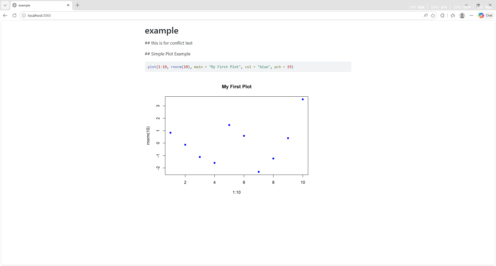
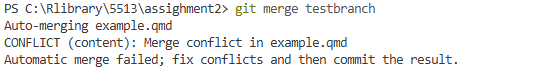

## The guide

1. Create a new RStudio Project. 

Open RStudio → New Project → New Directory → New Project
Name the project assignment2 and create it
Create a new Quarto file example.qmd with basic content, then knit it to HTML


2. Initialise Git & Push to GitHub

```{powershell}
git init
git add .
git commit -m "Initial commit: add assignment2 files"
git remote add origin https://github.com/yfan0161-stack/assignment2.git
git push -u origin main
```

3. Create testbranch & Push Changes
```{powershell}
git checkout -b testbranch
git add example.qmd
git commit -m "Modify example.qmd in testbranch"
git push origin testbranch
```

4.Add data Folder & Amend Commit
```{powershell}
git add data/
git commit --amend --no-edit
git push --force origin testbranch
```

5.Modify main to Create a Merge Conflict
Switch back to main
```{powershell}
git checkout main
```

Modify example.qmd at the same location as in testbranch to create a conflict
```{powershell}
git add example.qmd
git commit -m "Modify example.qmd on main to create merge conflict"
git push origin main
```

6.Merge testbranch & Resolve Conflict
```{powershell}
git merge testbranch
```

Resolve the conflict in example.qmd



```{powershell}
git add example.qmd
git commit -m "Resolve merge conflict between main and testbranch"
git push origin main
```

7.Tag the Commit v1.0
```{powershell}
git tag -a v1.0 -m "Version 1.0: merge completed and conflict resolved"
git push origin v1.0
```

8.Delete testbranch Locally & Remotely
```{powershell}
git branch -d testbranch
git push origin --delete testbranch
```

9.Show Condensed Commit Log
```{powershell}
git log --oneline
```

Output:
64b8416 (HEAD -> main, tag: v1.0, origin/main) Resolve merge conflict between main and testbranch
d088991 Modify example.qmd on main to create merge conflict
0dae4ee Modify example.qmd in testbranch
e83f51d Initial commit: add assignment2 files

10. Add Plot & Undo Commit Without Losing Changes
Add a new plot section to example.qmd
## Simple Plot Example
```{r}
plot(1:10, rnorm(10), main = "My First Plot", col = "blue", pch = 19)
```

git commands
```{powershell}
git add example.qmd
git commit -m "Add simple plot section to example.qmd"
git reset --soft HEAD~1
```


